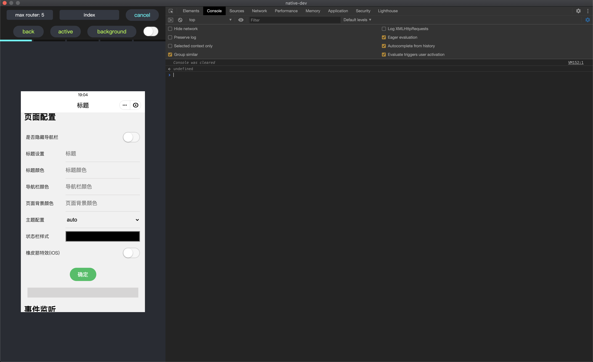

## light-web-electronjs
基于 electronjs 对于 [light-web](https://github.com/amazingCoding/light-web-core) 跨端 webview 框架的开发支持。


## 使用
```
npm i
npm start
```
可以自行打包

## 简介
### 2 个模型
* windows 统筹所有窗口切换
* page 开发页面
